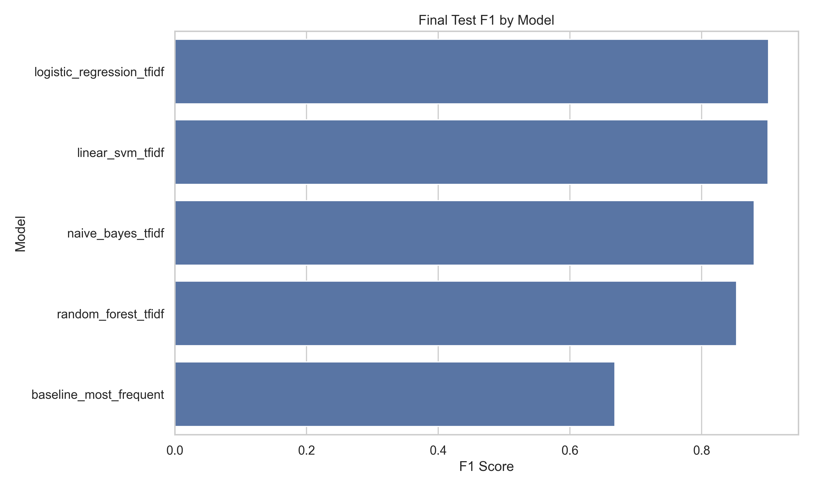
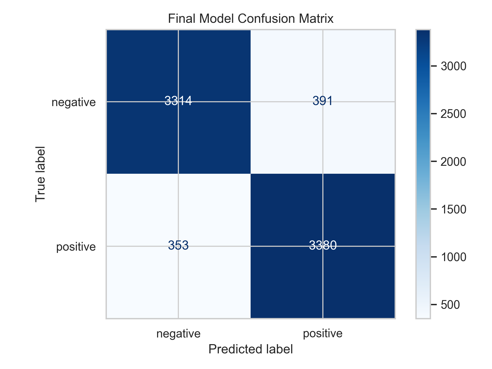
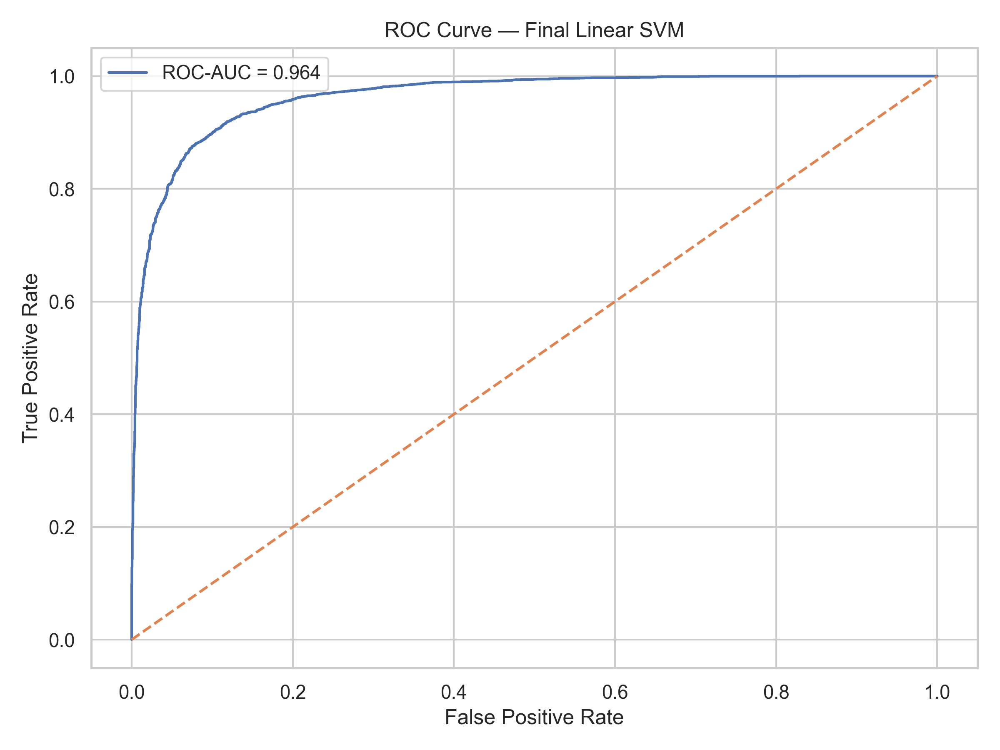
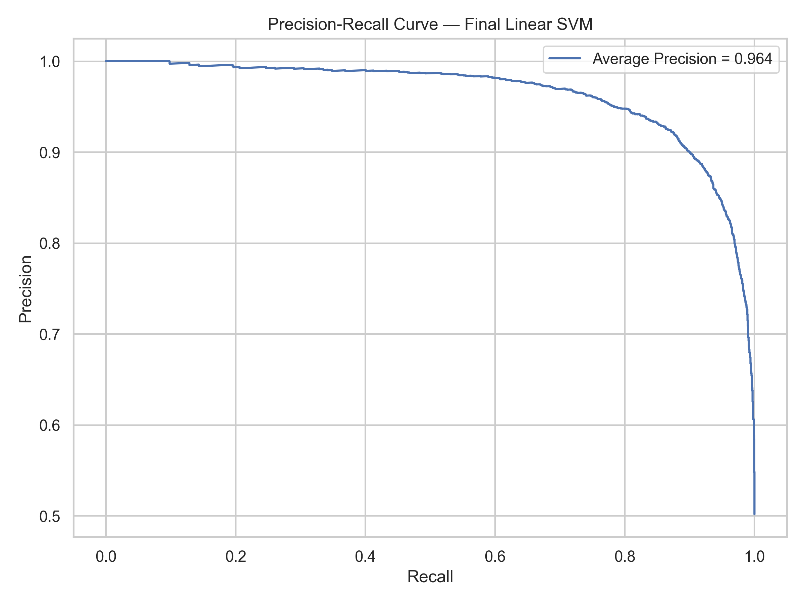
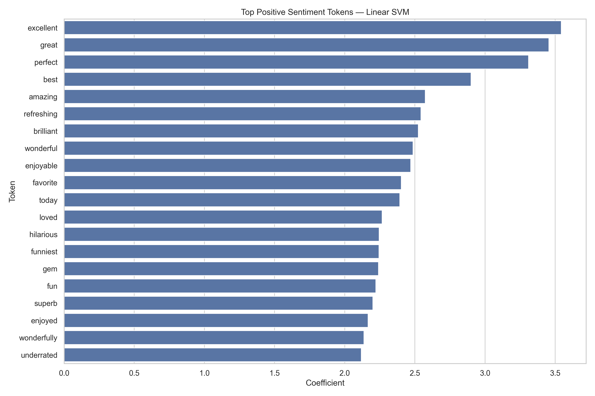
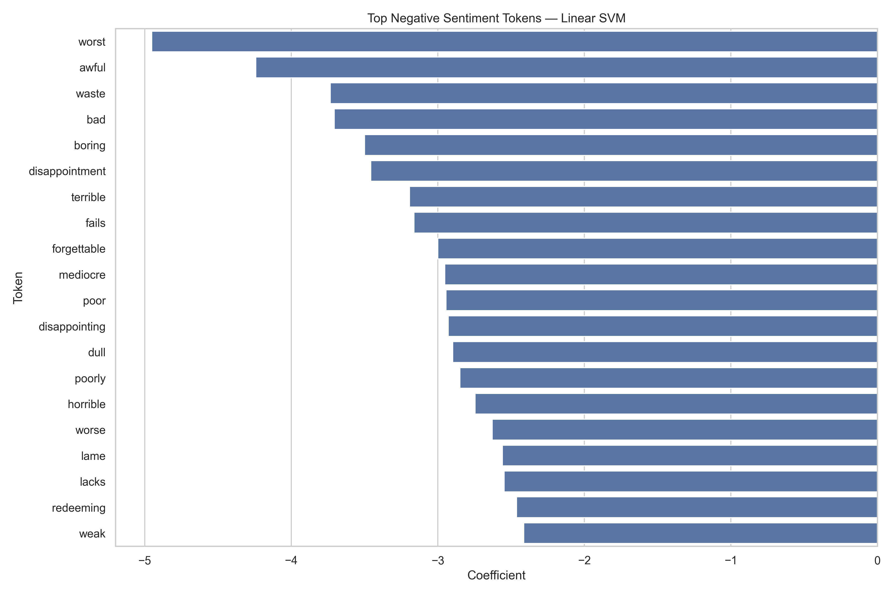
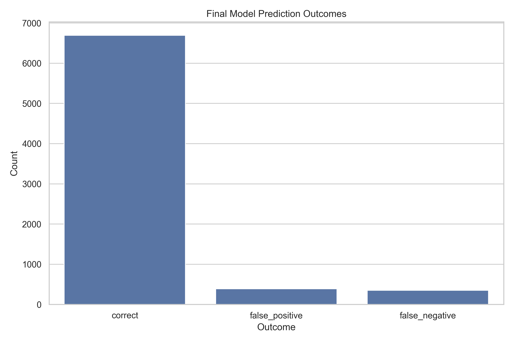
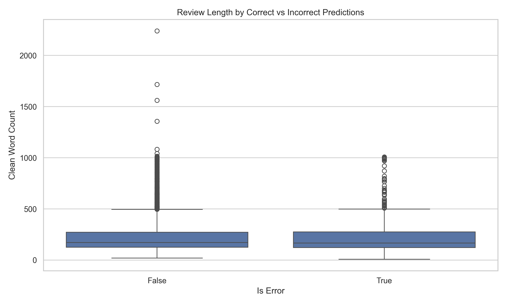
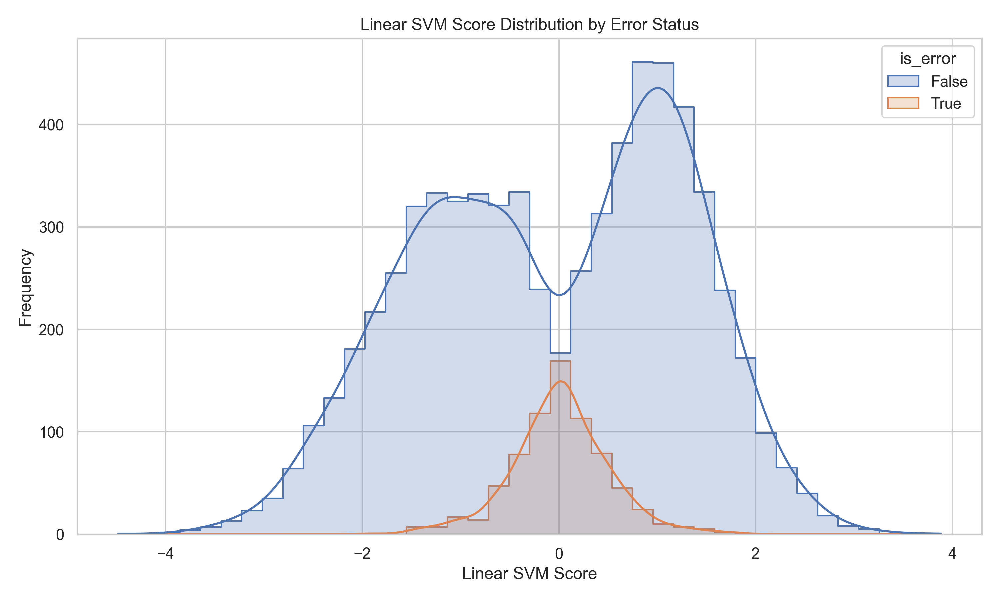

# Sentiment Analysis NLP: Classifying Movie Reviews with Machine Learning

## Overview

This project builds and evaluates NLP classification models to predict whether movie reviews express positive or negative sentiment.

The goal is not only to classify text, but also to demonstrate a complete NLP workflow: text cleaning, TF-IDF vectorization, model comparison, cross-validation, final test evaluation, token interpretation, and error analysis.

---

## Business Context

Sentiment analysis helps organizations understand opinions at scale.

A sentiment classifier can support:

- customer feedback monitoring,
- product review analysis,
- social media listening,
- brand perception analysis,
- market research.

However, sentiment models should not be treated as perfect judges of opinion. They can fail on sarcasm, negation, mixed sentiment, ambiguous phrasing, and domain-specific language.

---

## Dataset

This project uses the **IMDB Dataset of 50K Movie Reviews** from Kaggle.

The raw dataset contains movie review text and binary sentiment labels.

| Dataset | Rows | Columns |
|---|---:|---:|
| Raw IMDB reviews | 50,000 | 2 |
| Clean deduplicated reviews | 49,582 | 7 |
| Train split | 34,706 | 7 |
| Validation split | 7,438 | 7 |
| Test split | 7,438 | 7 |

Raw columns:

| Column | Description |
|---|---|
| `review` | Raw movie review text |
| `sentiment` | Sentiment label: positive or negative |

The binary modeling target is:

```text
sentiment_label
```

where:

| Label | Meaning |
|---:|---|
| 0 | Negative |
| 1 | Positive |

> Note: Raw Kaggle data files are not included in this repository. Users must download the dataset manually, rename it as `imdb_reviews.csv`, and place it inside `data/raw/`.

---

## Project Structure

```text
sentiment-analysis-nlp/
├── data/
│   ├── raw/
│   └── processed/
├── models/
├── notebooks/
│   └── 01_sentiment_analysis.ipynb
├── reports/
│   ├── executive_summary_en.md
│   ├── resumen_ejecutivo_es.md
│   ├── model_metrics.csv
│   ├── cross_validation_summary.csv
│   ├── final_test_metrics.csv
│   ├── final_classification_report.csv
│   ├── final_confusion_matrix.csv
│   ├── top_positive_tokens.csv
│   ├── top_negative_tokens.csv
│   ├── error_analysis.csv
│   └── figures/
├── src/
│   ├── audit_data.py
│   ├── cross_validate_models.py
│   ├── evaluate_models.py
│   ├── interpret_model.py
│   ├── load_data.py
│   ├── preprocess_text.py
│   └── train_models.py
├── README.md
├── requirements.txt
└── .gitignore
```

---

## Methodology

The project follows a reproducible NLP workflow:

1. Load raw IMDB review data.
2. Audit missing values, duplicates, HTML tags, class balance, and review length.
3. Remove duplicate review texts before splitting to avoid leakage.
4. Clean raw text by removing HTML, URLs, non-text characters, and repeated whitespace.
5. Create a binary sentiment target.
6. Build stratified train, validation, and test splits.
7. Train TF-IDF classification models.
8. Compare validation performance.
9. Run cross-validation on train plus validation data.
10. Select the final model before looking at the test set.
11. Evaluate final performance on the held-out test set.
12. Interpret token coefficients.
13. Analyze false positives and false negatives.

---

## Data Quality Summary

The raw dataset was balanced but required text cleaning.

| Check | Result |
|---|---:|
| Raw rows | 50,000 |
| Missing values | 0 |
| Exact duplicate rows | 418 |
| Duplicate review texts | 418 |
| Reviews with HTML tags | 29,202 |
| Positive reviews before cleaning | 25,000 |
| Negative reviews before cleaning | 25,000 |

The 418 duplicate review texts were removed before splitting the data. This prevents duplicate reviews from leaking across train, validation, and test splits.

---

## Text Preprocessing

The preprocessing pipeline performs the following steps:

1. Converts review and sentiment fields to consistent string format.
2. Validates that duplicate review texts do not have conflicting labels.
3. Removes duplicate review texts.
4. Decodes HTML entities.
5. Removes HTML tags such as `<br />`.
6. Converts text to lowercase.
7. Removes URLs.
8. Keeps alphabetic characters and apostrophes.
9. Normalizes repeated whitespace.
10. Creates binary sentiment labels.

The cleaning strategy keeps apostrophes because contractions and negations can matter in sentiment analysis.

---

## Class Balance After Preprocessing

The class distribution remains balanced after deduplication.

| Class | Count | Share |
|---|---:|---:|
| Positive | 24,884 | 50.19% |
| Negative | 24,698 | 49.81% |

The train, validation, and test splits preserve this balance through stratified splitting.

---

## Text Length Summary

The cleaned reviews vary substantially in length.

| Metric | Clean Word Count |
|---|---:|
| Mean | 229.94 |
| Median | 172 |
| Minimum | 6 |
| Maximum | 2,462 |

This variability matters because short reviews may lack context, while long reviews can contain mixed sentiment.

---

## Models Compared

The project compared the following models:

| Model | Description |
|---|---|
| Baseline most frequent | Majority-class classifier |
| Logistic Regression + TF-IDF | Linear classifier with TF-IDF text features |
| Linear SVM + TF-IDF | Linear margin-based classifier with TF-IDF text features |
| Naive Bayes + TF-IDF | Probabilistic text classifier |
| Random Forest + TF-IDF | Tree-based ensemble over sparse text features |

TF-IDF used:

- unigrams and bigrams,
- English stop-word removal,
- minimum document frequency filtering,
- maximum document frequency filtering,
- sublinear term frequency scaling.

---

## Validation Results

On the initial validation split, Logistic Regression achieved the highest F1-score.

| Model | Accuracy | Precision | Recall | F1 | ROC-AUC | Average Precision |
|---|---:|---:|---:|---:|---:|---:|
| Logistic Regression TF-IDF | 0.9013 | 0.8892 | 0.9178 | 0.9032 | 0.9637 | 0.9633 |
| Linear SVM TF-IDF | 0.9010 | 0.8959 | 0.9084 | 0.9021 | 0.9640 | 0.9630 |
| Naive Bayes TF-IDF | 0.8778 | 0.8698 | 0.8896 | 0.8796 | 0.9466 | 0.9455 |
| Random Forest TF-IDF | 0.8477 | 0.8239 | 0.8859 | 0.8537 | 0.9268 | 0.9247 |
| Baseline Most Frequent | 0.5019 | 0.5019 | 1.0000 | 0.6683 | 0.5000 | 0.5019 |

The baseline recall is misleading because the model predicts every review as positive.

---

## Cross-Validation Results

Cross-validation changed the final model decision.

| Model | Mean Accuracy | Mean ROC-AUC | Mean Average Precision |
|---|---:|---:|---:|
| Linear SVM TF-IDF | 0.8955 | 0.9608 | 0.9594 |
| Logistic Regression TF-IDF | 0.8946 | 0.9605 | 0.9596 |
| Naive Bayes TF-IDF | 0.8738 | 0.9456 | 0.9448 |
| Random Forest TF-IDF | 0.8432 | 0.9237 | 0.9213 |
| Baseline Most Frequent | 0.5019 | 0.5000 | 0.5019 |

Linear SVM achieved the best mean F1-score under cross-validation. It was selected as the final model before evaluating the held-out test set.

---

## Final Model

The final selected model is:

```text
Linear SVM + TF-IDF
```

It was selected because it achieved the strongest cross-validation F1 performance before test evaluation.

This matters because test data should be used for final evaluation, not for model selection.

---

## Final Test Evaluation

Final test results:

| Model | Accuracy | Precision | Recall | F1 | ROC-AUC | Average Precision |
|---|---:|---:|---:|---:|---:|---:|
| Logistic Regression TF-IDF | 0.9000 | 0.8893 | 0.9145 | 0.9017 | 0.9650 | 0.9649 |
| Linear SVM TF-IDF | 0.9000 | 0.8963 | 0.9054 | 0.9009 | 0.9642 | 0.9637 |
| Naive Bayes TF-IDF | 0.8790 | 0.8766 | 0.8832 | 0.8799 | 0.9495 | 0.9479 |
| Random Forest TF-IDF | 0.8463 | 0.8209 | 0.8875 | 0.8529 | 0.9277 | 0.9258 |
| Baseline Most Frequent | 0.5019 | 0.5019 | 1.0000 | 0.6683 | 0.5000 | 0.5019 |

Logistic Regression performs marginally better on the test split, but Linear SVM remains the final selected model because it was chosen through cross-validation before looking at test results.



---

## Final Confusion Matrix

The final Linear SVM model correctly classifies 6,694 out of 7,438 test reviews.

| Actual / Predicted | Predicted Negative | Predicted Positive |
|---|---:|---:|
| Actual Negative | 3,314 | 391 |
| Actual Positive | 353 | 3,380 |

The model makes:

- 391 false positives,
- 353 false negatives.

The error distribution is relatively balanced.



---

## Ranking Performance

The final model has strong ranking performance.

| Metric | Value |
|---|---:|
| ROC-AUC | 0.9642 |
| Average Precision | 0.9637 |

These metrics show that the model separates positive and negative sentiment well across decision thresholds.





---

## Token Interpretation

Linear SVM token coefficients were extracted to identify tokens associated with each sentiment class.

Strong positive tokens include:

- excellent,
- great,
- perfect,
- best,
- amazing,
- brilliant,
- wonderful,
- enjoyable,
- loved,
- superb.

Strong negative tokens include:

- worst,
- awful,
- waste,
- bad,
- boring,
- disappointment,
- terrible,
- fails,
- forgettable,
- mediocre,
- poor,
- dull,
- horrible.

These coefficients show statistical associations in the TF-IDF feature space. They are not causal explanations.





---

## Error Analysis

The final model produced:

| Outcome | Count |
|---|---:|
| Correct predictions | 6,694 |
| False positives | 391 |
| False negatives | 353 |

Error rate by actual sentiment:

| Actual Sentiment | Error Rate |
|---|---:|
| Negative | 10.55% |
| Positive | 9.46% |

The model makes slightly more errors on negative reviews. This suggests it is marginally more likely to classify some negative reviews as positive.

Review length alone does not explain model errors. Incorrect predictions have a similar median word count to correct predictions.







---

## Business Recommendations

1. Use the model for scalable sentiment monitoring, not as a perfect judge of opinion.
2. Use aggregate sentiment trends rather than relying only on individual predictions.
3. Review low-confidence predictions manually when decisions are high impact.
4. Monitor false positives and false negatives separately.
5. Re-train the model with domain-specific feedback before applying it outside movie reviews.
6. Add human review for ambiguous, sarcastic, or mixed-sentiment cases.
7. Avoid using the model as a fully automated moderation or decision system.

---

## Reports

- [Executive Summary — English](reports/executive_summary_en.md)
- [Resumen Ejecutivo — Español](reports/resumen_ejecutivo_es.md)

---

## Notebook

- [Sentiment Analysis Notebook](notebooks/01_sentiment_analysis.ipynb)

---

## How to Reproduce This Project

### 1. Clone the repository

```bash
git clone https://github.com/RommelPa/sentiment-analysis-nlp.git
cd sentiment-analysis-nlp
```

### 2. Create and activate a virtual environment

```bash
py -m venv .venv
.venv\Scripts\activate
```

### 3. Install dependencies

```bash
pip install -r requirements.txt
```

### 4. Download Kaggle file

Download the IMDB Dataset of 50K Movie Reviews from Kaggle.

Rename the CSV file as:

```text
imdb_reviews.csv
```

Place it here:

```text
data/raw/imdb_reviews.csv
```

Expected structure:

```text
data/
└── raw/
    └── imdb_reviews.csv
```

### 5. Run the pipeline

```bash
python src/load_data.py
python src/audit_data.py
python src/preprocess_text.py
python src/train_models.py
python src/cross_validate_models.py
python src/evaluate_models.py
python src/interpret_model.py
```

### 6. Open the notebook

```bash
jupyter notebook notebooks/01_sentiment_analysis.ipynb
```

---

## Tools Used

- Python
- pandas
- numpy
- matplotlib
- seaborn
- scikit-learn
- BeautifulSoup
- Jupyter Notebook
- Git
- GitHub

---

## Limitations

- The model is trained on movie reviews and may not generalize to other domains.
- TF-IDF does not deeply understand context, sarcasm, irony, or complex negation.
- Linear coefficients are useful for interpretation, but they are not causal explanations.
- The model does not use modern contextual embeddings or transformers in this version.
- Raw review text is not stored in repository outputs to avoid unnecessary dataset redistribution.
- Test performance may differ in real-world domains with shorter, noisier, or more informal text.

---

## Next Steps

This project can be extended by:

- adding calibrated probability estimates for decision threshold tuning,
- adding manual review workflow for low-confidence predictions,
- testing the model on another review domain,
- comparing TF-IDF with word embeddings or sentence embeddings,
- adding transformer-based modeling in a future version,
- building a lightweight inference API in a later deployment project.

---

## Spanish Summary

Este proyecto construye y evalúa modelos de NLP para clasificar reseñas de películas como positivas o negativas.

El modelo final seleccionado fue Linear SVM con TF-IDF, elegido por validación cruzada antes de mirar el test. En el set final de prueba alcanzó accuracy de 0.9000, F1-score de 0.9009, ROC-AUC de 0.9642 y Average Precision de 0.9637.

El proyecto incluye limpieza de texto, deduplicación antes del split, vectorización TF-IDF, comparación de modelos, validación cruzada, evaluación final, matriz de confusión, interpretación de tokens, análisis de errores, notebook narrativo y reportes ejecutivos bilingües.